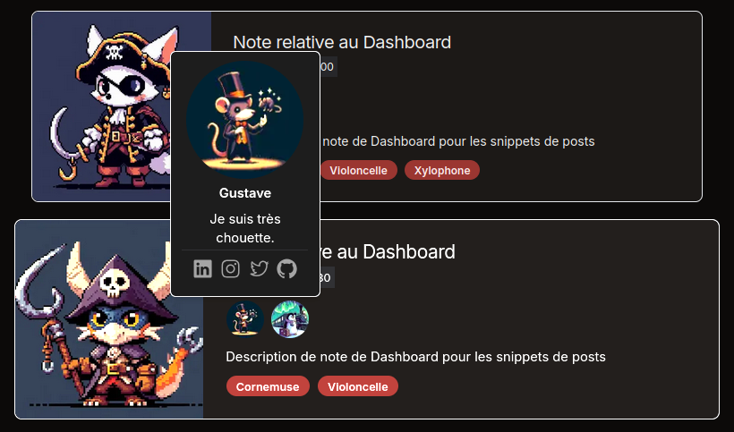

# Blog authors

Let's explore the authors feature!

---

## The authors documents front-matter

Let's create a dummy blog document.

```markdown
---
title: Note
metadescription: Meta description
description: Description
date: 2019-08-14 21:00
---

Hello world!
```

By default, this document will not have any author.

You can tweak it to enable the authors feature just like so:

```markdown
---
authors: ['Gustave', 'Arnaud']
title: Note
metadescription: Meta description
description: Description
date: 2019-08-14 21:00
---

Hello world!
```

You can also write it as follows:

```markdown
---
authors:
  - Gustave
  - Arnaud
title: Note
metadescription: Meta description
description: Description
date: 2019-08-14 21:00
---

Hello world!
```

Because of a weird Contentlayer bug, keep the `authors` field at the top of the document properties. Otherwise, it could break its parsing on Windows.

**Don't forget to describe the authors for your blog post in all its different languages.**

## The Authors Config file

It is possible to manage the blog authors thanks to the [_blog authors config file_.](/interop/config/contentlayer/blog/authors.ts)

Let:

```ts
// interop/config/contentlayer/blog/authors.ts
export const authors = {} as const satisfies Record<AuthorName, Author>;
```

Become:

```ts
// interop/config/contentlayer/blog/authors.ts
export const authors = {
  // * ... Added Gustave
  Gustave: {
    medias: {
      linkedin: 'https://www.linkedin.com/in/terry-a-davis',
      instagram: 'https://www.instagram.com/justinbieber',
      twitter: 'https://twitter.com/realdonaldtrump',
      github: 'https://github.com/gustaveWPM'
    },

    profilePictureUrl: '/assets/medias/img/dev/placeholders/placeholder-54.jpeg'
  },

  // * ... Added Arnaud
  Arnaud: {
    profilePictureUrl: '/assets/medias/img/dev/placeholders/placeholder-55.jpeg'
  }
} as const satisfies Record<AuthorName, Author>;
```

Then, you'll notice a new error in your [locale files.](/src/i18n/locales)

For instance:

> Type '{}' is missing the following properties from type 'MakeHomogeneousValuesObjType<Record<"Gustave" | "Arnaud", AuthorVocabArborescence>,
> string>': Gustave, Arnaud

This is because your [i18n schema file](/src/i18n/locales/schema.ts) injects i18n constraints to force you to declare the translations of your blog
authors:

```ts
// src/i18n/locales/schema.ts
authors: blogAuthorOptionsVocabSchema;
```

Let's fix it!

Turn this:

```ts
// src/i18n/locales/fr.ts
'authors': {}
```

Into this:

```ts
// src/i18n/locales/fr.ts
authors: {
  Arnaud: {
    bio: 'Je suis complètement zinzolin.',
    alt: 'Arnaud'
  },

  Gustave: {
    bio: 'Je suis très chouette.',
    alt: 'Gustave'
  }
}
```

Adapt all your locales like this, then, go to your blog category page.

---

<p align="center"></p>
<p align="center"></p>

Congrats!  
You made it!
